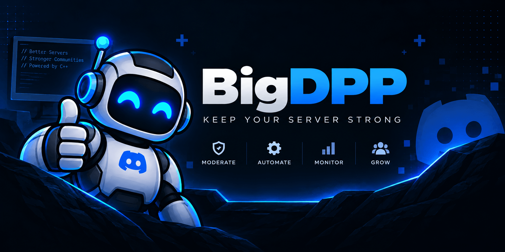

# BigDPP



A C++ Discord operations bot for server maintenance, moderation, diagnostics, announcements, logging, and administrative automation.

## Project status

BigDPP is in **Phase 1 — Discord Foundation**. The native foundation,
initial DPP integration, local LLM flow, and explicit administrator commands are
implemented locally; live Discord verification awaits test credentials.

## Direction

The optional local AI flow is implemented for `/ask`; enable it only when a
loopback Ollama service and a dedicated AI channel are available.

BigDPP targets C++20, DPP/D++, CMake, nlohmann-json, and Ollama for optional
local AI. PostgreSQL/libpqxx, spdlog, and Docker remain later roadmap items. It
is designed as a production-oriented modular monolith for a real Discord server,
with explicit Discord commands kept separate from the prompt-only local AI.

## Local LLM

BigDPP uses a local [Ollama](https://ollama.com/) runtime for `/ask`; it does
not send prompts to a hosted LLM. The model is configurable through
`BIGDPP_LLM_MODEL` and the example configuration uses `llama3.2`. When enabled,
BigDPP calls Ollama's loopback `POST /api/chat` endpoint asynchronously with a
non-streaming request. The model receives only the member's question and a
fixed assistant instruction; it cannot read Discord state, access credentials,
or execute server-management commands.

Enable it with `BIGDPP_LLM_ENABLED=true`, download the selected model with
`ollama pull <model>`, and use `BIGDPP_LLM_AUTOSTART` to control whether BigDPP
starts `ollama serve` automatically. See the [configuration reference](docs/configuration.md)
for all LLM settings.

## Branding

- `branding/github-social-preview.png` — GitHub repository social preview, 1774×887
- `branding/Banner.png` — original project banner
- `branding/Logo.png` — project logo

## Documentation

- [Start here: codebase tour](docs/codebase-tour.md)
- [Architecture](docs/architecture.md)
- [Development guide](docs/development.md)
- [Editing and extension guide](docs/extending.md)
- [Configuration reference](docs/configuration.md)
- [Command reference](docs/commands.md)
- [Discord application setup](docs/discord-setup.md)
- [Security and operations baseline](docs/security-and-operations.md)
- [Local LLM decision](docs/decisions/0002-local-llm-ask-channel.md)
- [Administrator command decision](docs/decisions/0003-explicit-admin-commands.md)
- [Delivery roadmap](docs/roadmap.md)
- [Repository working instructions](AGENTS.md)

If you are new to the project, read the codebase tour first, follow the
development guide to build and test, then use the editing guide before adding a
command or module.

## Implemented

- C++20 CMake executable and reusable core target
- environment-backed configuration with validation
- pinned vcpkg manifest
- DPP 10.1.5 Gateway adapter using the Guilds and Guild Members intents
- `/ping` and `/status` commands
- `/ask` for questions answered by a local Ollama model in the `ai-agent` channel
- automatic discovery or creation of the configured AI text channel
- explicit owner/Administrator server-management commands with confirmation and role hierarchy checks
- additive `/server-setup` baseline for categories, channels, roles, and restricted `#mod-log`
- process and `#mod-log` audit records for administrative actions
- development-guild or global bulk command registration
- secure ignored `.env` fallback with process-environment precedence
- offline CTest configuration and administrator-command coverage
- project scope, architectural boundaries, phased roadmap, and development/security policies

## Planned

- live test-guild verification of Phase 1 and the administrative command surface
- remaining container and CI verification
- PostgreSQL persistence and migrations
- Read-only server diagnostics
- PostgreSQL-backed warnings, durable audit history, announcements, audit events, and advanced maintenance in later phases

See the [roadmap](docs/roadmap.md) for phase acceptance criteria. Planned features are intentionally not presented as available commands.

## Installation and build on Windows

### Prerequisites

- Windows 10 or newer
- Visual Studio Build Tools with the Desktop C++ workload and Windows SDK
- CMake 3.25 or newer
- Ninja
- vcpkg
- A Discord bot application and token
- Ollama only if `/ask` is needed

DPP and nlohmann-json are installed automatically through the checked-in vcpkg
manifest. Node.js is not required.

### Configure and build

If vcpkg is not installed, bootstrap it once:

```powershell
git clone https://github.com/microsoft/vcpkg.git C:\tools\vcpkg
& C:\tools\vcpkg\bootstrap-vcpkg.bat
```

Open a new terminal, then activate the Visual Studio developer environment:

```powershell
cmd.exe /k VsDevCmd.bat -arch=x64 -host_arch=x64
```

In that developer shell, set `VCPKG_ROOT` to your vcpkg installation and run:

```powershell
$env:VCPKG_ROOT = "C:\path\to\vcpkg"
cmake --preset windows-debug
cmake --build --preset windows-debug
ctest --preset windows-debug
```

The first configure may build the manifest dependencies and take several
minutes. The generated executable is
`out\build\windows-debug\bigdpp.exe`.

### Configure Discord credentials

From the repository root, create the ignored settings file:

```powershell
Copy-Item .env.example .env
```

Set `DISCORD_TOKEN` and, during development, `DEVELOPMENT_GUILD_ID` in `.env`.
Guild registration is fast; without that value, commands are registered
globally and may take longer to appear. Complete the Discord application setup
in [Discord Application Setup](docs/discord-setup.md) before starting the bot.

### Optional local LLM setup

Install [Ollama](https://ollama.com/), download the configured model, and set
these values in `.env`:

```dotenv
BIGDPP_LLM_ENABLED=true
BIGDPP_LLM_AUTOSTART=true
BIGDPP_LLM_BASE_URL=http://127.0.0.1:11434
BIGDPP_LLM_MODEL=llama3.2
BIGDPP_AI_CHANNEL_NAME=ai-agent
```

```powershell
ollama pull llama3.2
```

When `BIGDPP_LLM_AUTOSTART=true`, BigDPP starts `ollama serve` itself. Set it
to `false` when Ollama is managed separately.

### Start BigDPP

```powershell
.\out\build\windows-debug\bigdpp.exe
```

Stop the development process with `Ctrl+C`. Graceful shutdown is planned for
production hardening. Never commit `.env` or expose the bot token in logs.

## Commands

| Command | Status | Purpose |
| --- | --- | --- |
| `/ping` | Implemented | Verify that BigDPP responds |
| `/status` | Implemented | Show the bot's online identity |
| `/ask question:<text>` | Implemented | Ask the configured local LLM; available only in `#ai-agent` by default |

Administrative commands are available only to the guild owner or a member with
Discord Administrator. Destructive commands require `confirm:true`, and target
members and roles must be below BigDPP's highest role. See the
[command reference](docs/commands.md) for parameters, required bot permissions,
and the exact confirmation behavior. The command groups are:

- `/server-info`, `/server-edit`, `/server-setup`
- `/channel-create`, `/channel-edit`, `/channel-delete`, `/channel-lock`, `/channel-unlock`, `/channel-access`
- `/role-create`, `/role-edit`, `/role-delete`, `/role-add`, `/role-remove`
- `/member-warn`, `/member-timeout`, `/member-untimeout`, `/member-kick`, `/member-ban`, `/member-unban`
- `/messages-purge`, `/audit-log`

`/create-role` remains as a compatibility alias for `/role-create`. Validation
responses are ephemeral; deferred mutation responses are completed
asynchronously. `/ask` is chat-only and cannot invoke these commands or mutate
the server.

The local LLM is prompt-only: it cannot inspect Discord state or invoke
administrator commands. See the [command reference](docs/commands.md) for the
available server-management operations and their safety checks.
